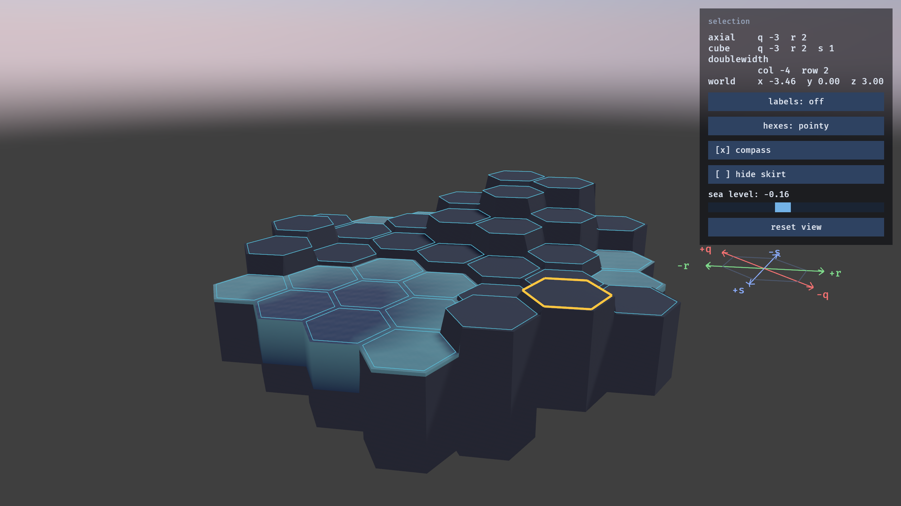

# hex-terrain

**[Run it in a browser](https://davidantliff.github.io/hex-terrain/)** — the live wasm build. It is
a ~14 MB download, so give it a moment on first load.

A Bevy 0.19 sandbox: a hexagonal grid of terrain and water under a daylight sky, with editor-style
camera controls. The grid is a hexagon of side 4 — 37 locations — addressable in axial, cube and
doubled coordinates, following
[Red Blob Games' hexagon guide](https://www.redblobgames.com/grids/hexagons/).

The sky is generated at startup from an analytic daylight model, and also lights the scene — so
there is no sky asset to fetch and a fresh clone runs as-is.

Design notes and accumulated knowledge live in `spec/` — start at `spec/home.md`.

## Controls

The scene-view scheme every 3D editor uses. There are no camera modes: a button is held or it is
not.

| Input                                    | Action                                                                   |
| ---------------------------------------- | ------------------------------------------------------------------------ |
| **Left click**                           | Select a hexagon.                                                        |
| **Right drag**                           | Fly. Mouse looks, `WASD` moves, `E`/`Q` up and down, `Shift` runs, the wheel changes speed. |
| **Middle drag**                          | Turn about the point under the cursor.                                   |
| **Shift + middle drag**                  | Pan.                                                                     |
| **Wheel**                                | Zoom towards the cursor.                                                 |
| **Escape**                               | Quit.                                                                    |

Turning is on the middle button rather than Unity's `Alt`+left because i3 — and most Linux window
managers — grab `Alt`+drag for themselves before the app ever sees it.

The panel top right reports the selected hexagon in axial, cube and doubled coordinates plus world
position, and carries six controls: cycle the per-hex labels (axial / cube / doubled / off), toggle
pointy-top against flat-top, show or hide the axis compass, hide the skirt to see the terrain as a
bare shell, move the sea level, and reset the view to look straight down with everything in frame.

See `spec/camera-controls.md` for why the bindings are these ones.

## Driving it from a script

The app can be aimed, captured and read without anyone at the keyboard. Every variable below is
optional and off by default, so a plain `cargo run` is unaffected.

    HEX_TERRAIN_CAMERA='top;iso;low;fit' \
    HEX_TERRAIN_SCREENSHOT=/tmp/s.png \
    HEX_TERRAIN_REPORT=/tmp/s.json \
    HEX_TERRAIN_WINDOW=1280x720 \
      cargo run -- two-lakes

| Variable                 | Value                    | Effect                                          |
| ------------------------ | ------------------------ | ----------------------------------------------- |
| `HEX_TERRAIN_CAMERA`     | `;`-separated poses      | Aims the camera; one capture per pose.          |
| `HEX_TERRAIN_SCREENSHOT` | path                     | A PNG per capture, then exit.                   |
| `HEX_TERRAIN_REPORT`     | path, or `-` for stdout  | A JSON report per capture.                      |
| `HEX_TERRAIN_INTERVAL`   | `<frames>x<count>`       | Capture `count` times per pose, `frames` apart. |
| `HEX_TERRAIN_WINDOW`     | `<W>x<H>`                | Pins the window size, in logical pixels.        |

A pose is one of three things:

- a preset — `top`, `iso`, `low`, or `fit` (framed on the whole scene);
- `yaw,pitch,radius` in degrees, degrees and world units, about the origin;
- `free:x,y,z@tx,ty,tz` — an eye point and what it looks at, in world units. This is how to reach a
  view from inside the scene, which no orbit angle can: `free:2.5,1.2,2.5@0,0.3,0` stands between
  the prisms at ground level.

With more than one capture an index goes in before the extension (`/tmp/s-00.png`, `-01`, …); a
single capture writes exactly the path given.

The report says what a picture cannot: the pose actually used, the window really rendered, mesh and
vertex counts per kind, the model's heights and water levels, and the frame rate. It is also the
index — each one names the pose and tick it came from.

Screenshots come from the app's own framebuffer rather than the X server, because a window on an
inactive workspace is unmapped and captures blank. Pinning the size is what makes two runs
comparable; the image is the pinned size times the display's scale factor, and the report records
what was actually rendered.

See `spec/instrumentation.md` for the details.

## Native

    cargo run                 # the `sea` scene
    cargo run -- two-lakes    # or any other scene name

Scenes are named grids in `src/hex/scenes.rs`; an unknown name lists the valid ones. The web build has
no arguments and always shows the default.

- `sea` — the sandbox: undulating ground flooded to a single level, driven by the panel's slider.
- `two-lakes` — two bodies at different levels divided by a land bridge one hex wide.
- `terraces` — three bodies at three levels over two bridges, one tall enough that only the upper body
  reaches it and one low enough that both do.

The last two are diagnostics for how a water surface is divided between bodies where they come close.

Bevy is linked dynamically on native targets, which cuts an edit-rebuild cycle from ~40s to
~2s. The binary therefore needs `libbevy_dylib.so` alongside it at runtime — `cargo run` handles
that, but copying the bare binary elsewhere will not work.

`.cargo/config.toml` puts intermediate build artefacts in `~/.cargo/hex-terrain-build`, shared by
every worktree of this project, so Bevy is compiled once rather than once per worktree. Each
worktree still has its own `target/` for the final binary. The cost is that two worktrees building
at the same time serialise on a lock; see `spec/wiki/build-performance.md`.

## Web

**Live at [davidantliff.github.io/hex-terrain](https://davidantliff.github.io/hex-terrain/)** — a
push to `main` rebuilds and redeploys it. The wasm is 52 MB on disk but 14 MB over the wire, because
Pages serves it gzipped.

    trunk serve --open                      # dev server on 127.0.0.1:8080

    trunk build --release                   # static files in dist/
    python3 -m http.server -d dist 8080     # or any static server

The deploy is `.github/workflows/pages.yml`; it adds `--public-url /hex-terrain/`, which the
subpath needs. See `spec/wiki/build-performance.md` for what that flag fixes.

## The starfield cubemap

**Nothing loads this.** The scene's sky was once an all-sky star map; it was replaced by the
generated daylight sky when water arrived, because a night sky gives a mirror nothing to reflect.
The generator and its asset are kept, unwired, for a possible night mode — see `spec/scene.md` and
`spec/wiki/skybox-pipeline.md`.

`assets/textures/starmap_cubemap.png` is committed, so nothing above needs this. To rebuild it
(needs ImageMagick with the OpenEXR delegate, plus numpy):

    python3 tools/make_skybox.py --check          # geometry asserts only
    python3 tools/make_skybox.py --exposure 0.25  # download sources, reproject, write PNG

Starfield imagery: *Deep Star Maps 2020*, NASA/Goddard Space Flight Center Scientific
Visualization Studio, incorporating ESA/Gaia data. Public domain.
